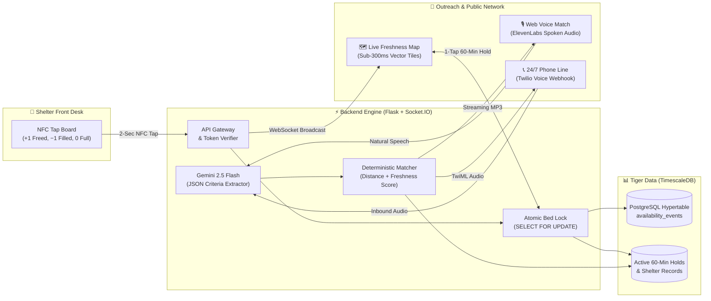

<div align="center">

# Luminest<span style="color:#0b7f57">BC</span>

### *Find the lights still on.*

A live, high-velocity shelter-bed network connecting outreach workers directly to verified open beds across Metro Vancouver. Built for **StormHacks 2026**.

<br/>

[](https://lumi-nest-bc.vercel.app)
[](https://luminestbc-api.onrender.com/health)

<br/>

[](https://devpost.com)
[](https://react.dev)
[](https://www.typescriptlang.org)
[](https://python.org)
[](https://timescale.com)
[](https://ai.google.dev)
[](https://elevenlabs.io)

<p align="center">
  <a href="https://lumi-nest-bc.vercel.app"><b>🌐 Open Live Web App</b></a> •
  <a href="#-quick-start">Quick Start</a> •
  <a href="#-the-solution">The Solution</a> •
  <a href="#-key-features">Key Features</a> •
  <a href="#-system-architecture">Architecture</a> •
  <a href="#-real-production-data">Real Metro Vancouver Data</a> •
  <a href="docs/pitch/presentation.html">Pitch Deck</a> •
  <a href="docs/pitch/demo_video.html">Demo Reel</a>
</p>

---

</div>

## 🌧️ The Reality at 11:00 PM on East Hastings

An outreach worker is on a rain-slicked sidewalk with someone shivering in the cold who has a dog and needs an accessible bed.

* **The Stale Data Trap:** The worker opens the official [BC211 shelter list](https://bc.211.ca/shelter-lists/). It updates only twice a day on weekdays. Over nights and weekends, **it is completely frozen**—often 24 to 48 hours out of date.
* **The Blind Call Cycle:** Workers spend **45 to 60 minutes making blind phone calls** from the sidewalk. Most shelters are already full.
* **Frontline Exhaustion:** Shelter staff field dozens of identical phone calls all night while trying to manage intake and guest safety.
* **The Tragedy:** Every night, people sleep on wet concrete while beds six blocks away sit empty because nobody knew they opened at 10:30 PM.

> [!IMPORTANT]
> **The Problem Isn't Just Beds. It's Information Velocity.**  
> Past government portals failed because entering data was too high-friction for overworked shelter staff. We designed LuminestBC backwards from a busy front desk: **updating takes a 2-second phone tap with zero login and zero app install.**

---

## ⚡ System Architecture & Data Flow



---

## 💡 The Three Connected Pillars

LuminestBC bridges the information divide with three tightly integrated systems:

### 1. 🏷️ Flow A: The 2-Second NFC Tap Board (Front Desk)
* **Zero Friction:** Staff never log in, remember passwords, or download an app.
* **Physical NFC Tags:** Three inexpensive stickers mounted beside the intake desk:
  * 🟢 **Bed Freed (+1):** Guest checks out early. One phone tap adds a bed.
  * 🔴 **Bed Filled (−1):** Guest checks in. One phone tap claims a bed.
  * ⚫ **Full (0):** Shelter hits capacity. One phone tap sets availability to 0.
  * 🔵 **Arrival:** Guest arrives for an active hold. One door tap confirms arrival.
* **Fail-Safe Idempotency:** Tokenized cryptographic tap IDs ensure cell signal retries never double-count. A 5-second debounce prevents accidental double-taps.
* **10-Second Undo Banner:** An instant floating bar allows staff to reverse a mistaken tap with a single touch.

### 2. 🗺️ Flow B: Live Freshness Map (Outreach Workers)
* **Sub-Second Real-Time Sync:** When a staff member taps an NFC tag in Surrey, the bed count updates on every outreach worker's phone in Vancouver in **under 300ms** via WebSockets.
* **Honest Data Freshness Clocks:**
  * 🟢 **Green Halo (< 60 min):** Staff confirmed recently. Confident to dispatch immediately.
  * 🟡 **Amber Halo (1–3 hours):** Getting stale; tap-to-call button prominently highlighted.
  * 🔴 **Red Halo (> 3 hours):** Unconfirmed count. Clearly flagged so workers avoid dead ends.
* **1-Tap Accessibility & Needs Filters:** Instant toggles for Women Only, Youth (<24), Families, Pets Allowed, Wheelchair/Accessible, and Couples.

### 3. 🎙️ Flow C: Voice Match & 60-Minute Guaranteed Holds
* **In-App Mic or 24/7 Phone Hotline:** Outreach workers press the mic button directly on the map (or dial the 24/7 Twilio hotline) and state needs naturally (*"Woman with a small dog near Main and Hastings, uses a walker"*).
* **Gemini 2.5 Flash:** Parses natural speech into structured JSON criteria without touching personal names.
* **Deterministic Matcher:** Plain, auditable Python applies hard demographic rules and ranks real shelters:
  $$\text{Score} = \text{Distance (km)} + \min\left(\frac{\text{Staleness (min)}}{30}, 10\right)$$
* **ElevenLabs Audio Narration:** Streams high-fidelity spoken responses with clear reasoning badges: `[Accessible ✓] [Pets OK ✓] [3 min walk]`.
* **Atomic 60-Minute Bed Hold:** Clicking **"Hold Bed"** locks the bed using PostgreSQL row-level locks (`SELECT FOR UPDATE`). The public count drops by 1 immediately. If a guest does not arrive within 60 minutes, an automated server cron releases the bed back into the public pool.

---

## 🛡️ Privacy by Architecture (Not Just Policy)

* **Zero Client PII:** We never ask for or store client names, dates of birth, or case histories.
* **Domestic Violence (DV) Shelter Fortress:** Domestic violence facilities are mathematically sanitized at the database boundary (`public_shelter()`). Latitude, longitude, street address, and phone numbers are stripped before any byte leaves the server. The UI only ever shows: *"Confidential safe-housing available: Call [Hotline]"*.
* **Auditable Time-Series:** Every tap, hold, check-in, and release is permanently recorded in a TimescaleDB hypertable for seasonal shelter capacity planning.

---

## 📊 Real Metro Vancouver Data (In Production)

LuminestBC is built and seeded with **67 real facilities across Metro Vancouver**:

| Metric | Real Production Numbers |
|---|---|
| **Mapped Shelters** | **67 facilities** across Vancouver, Surrey, Burnaby, Richmond, New Westminster, North Vancouver |
| **Total Tracked Capacity** | **1,850+ shelter beds** |
| **Geocoded Coordinates** | 100% geocoded with verified street addresses |
| **Voice Match Latency** | **< 600 ms** Gemini structured extraction + deterministic match |
| **Database Query Speed** | **< 15 ms** queries on Tiger Data TimescaleDB Cloud |
| **Realtime Broadcast** | **< 300 ms** WebSocket sync to all connected clients |

---

## 🚀 Quick Start

> [!TIP]
> **Prefer to test online?** You can test the fully deployed live application directly without any local installation: **[https://lumi-nest-bc.vercel.app](https://lumi-nest-bc.vercel.app)**

### Prerequisites
- Node.js 20+
- Python 3.11+ (or WSL / Ubuntu on Windows)
- Docker (optional for local database; project connects to Tiger Data Cloud by default)

### Option A: The All-in-One Server (Fastest)

Since the frontend is pre-built, the Flask backend can serve the complete application on a single port:

```bash
# 1. Clone the repository
git clone https://github.com/saman-37/LumiNestBC.git
cd LumiNestBC

# 2. Start the backend (serves API + Frontend on Port 8000)
cd backend
source .venv/bin/activate    # On Windows: .venv\Scripts\activate or use WSL
python run.py
```

Open your browser to: **`http://localhost:8000`**

---

### Option B: Development Mode (Hot-Reloading)

For active frontend and backend development:

**Terminal 1 — Backend (Port 8000):**
```bash
cd backend
source .venv/bin/activate
python run.py
```

**Terminal 2 — Frontend (Port 5173):**
```bash
cd frontend
npm install
npm run dev
```

Open your browser to: **`http://localhost:5173`** (Vite automatically proxies `/api`, `/socket.io`, and `/audio` to port 8000).

---

## 🧪 Testing & Verification

Run the comprehensive 34-unit test suite covering communications, matcher algorithms, voice caches, and database transactions:

```bash
cd backend
source .venv/bin/activate
pytest tests/test_comms.py tests/test_matcher.py tests/test_voice_cache.py
```

```
============================== 34 passed in 0.95s ==============================
```

To build and typecheck the frontend:
```bash
cd frontend
npm run build    # tsc --noEmit && vite build
```

---

## 📂 Project Structure

```
LumiNestBC/
├── backend/
│   ├── app/
│   │   ├── comms/              # Twilio webhook routes, Gemini parser, ElevenLabs TTS
│   │   ├── routes/             # Shelters, tags, holds, staff portal, admin routes
│   │   ├── db.py               # Tiger Data TimescaleDB connection pool & schema
│   │   ├── matcher.py          # Deterministic ranking (Distance + Freshness)
│   │   └── sockets.py          # Real-time WebSocket event broadcaster
│   ├── run.py                  # Local dev server & static asset host
│   └── tests/                  # Pytest test suite (34 unit tests)
│
├── frontend/
│   ├── src/
│   │   ├── components/         # VoiceMatchSheet, Map, TapBoard, Filters, ActivityList
│   │   ├── pages/              # MapPage, StaffPage, HoldPage, TapPage, AdminPage
│   │   └── lib/                # API client, WebSocket listener, map styling
│   ├── package.json
│   └── vite.config.ts
│
├── docs/
│   ├── pitch/
│   │   ├── presentation.html   # Interactive light-mode presentation deck
│   │   ├── demo_video.html     # Automated 2-minute video recording studio
│   │   ├── DEMO_VIDEO_GUIDE.md # Devpost video guide & storyboard
│   │   └── pitch_deck.md       # Complete Markdown slide deck
│   ├── architecture.md         # Detailed system design & threat model
│   └── DEPLOY.md               # Production deployment runbook
│
└── scripts/
    ├── generate_tag_links.py   # Generates cryptographic NFC URLs
    ├── import_shelters.py      # Seeds 67 Metro Vancouver shelters
    └── generate_demo_voiceover.py # ElevenLabs narration builder
```

---

## 🎬 Presentation & Pitch Assets

* 📊 **Interactive Pitch Deck:** Double-click [`docs/pitch/presentation.html`](docs/pitch/presentation.html) in any browser for keyboard-navigable slides (`←`/`→`/`Space`), speaker notes (`N`), and live NFC tap simulations.
* 🎥 **2-Minute Demo Video Player:** Open [`docs/pitch/demo_video.html`](docs/pitch/demo_video.html) to run the automated synchronized video reel with built-in screen recording.
* 📄 **Markdown Slide Deck:** [`docs/pitch/pitch_deck.md`](docs/pitch/pitch_deck.md)

---

## 👥 StormHacks 2026 Team

Built with ❤️ for Metro Vancouver by the **LuminestBC** team at **StormHacks 2026**.

* 🌐 **Live Web Application:** [https://lumi-nest-bc.vercel.app](https://lumi-nest-bc.vercel.app)
* ⚡ **Live API Service:** [https://luminestbc-api.onrender.com](https://luminestbc-api.onrender.com)
* 🔗 **Custom Domain:** [https://luminestbc.tech](https://luminestbc.tech)
* 💻 **GitHub Repository:** [github.com/saman-37/LumiNestBC](https://github.com/saman-37/LumiNestBC)
