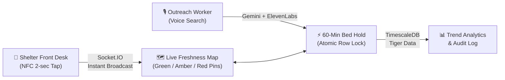
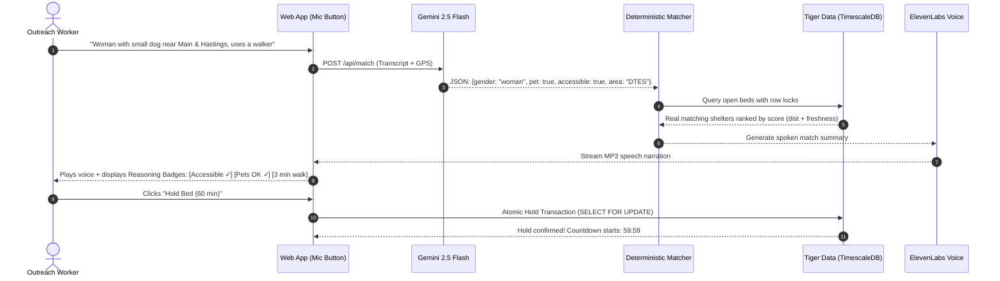

# LuminestBC — Pitch Deck

> **"Find the lights still on."**  
> *StormHacks 2026 · Metro Vancouver Live Shelter-Bed Network*

---



---

## Slide 1: The Problem (Initially)

### 11:00 PM on East Hastings, Rain Falling
An outreach worker is standing on the sidewalk with someone shivering in the cold who has a small dog and needs an accessible bed.

- **The Stale Data Trap:** The worker opens the official **BC211 shelter list**. It was last updated at 7:30 PM on Friday. BC211 updates only twice a day on weekdays. Over weekends and nights, **it is completely frozen** (often 27+ hours out of date).
- **The Blind Phone Call Grunt Work:** Outreach workers spend **45 to 60 minutes making blind phone calls** from the sidewalk to shelter after shelter. Most are full.
- **Frontline Exhaustion:** Shelter desk staff field dozens of identical phone calls all night while trying to manage intake and guest safety.
- **The Tragedy:** Every night in Metro Vancouver, people sleep on wet concrete while open beds sit empty just 6 blocks away because nobody knew they freed up at 10:30 PM.

> [!IMPORTANT]
> **The Problem Isn't Just Beds. It's Information Velocity.**

---

## Slide 2: The Solution — Three Connected Pillars

LuminestBC eliminates data-entry friction and instantly connects outreach workers to real, open beds through three interconnected systems:

```
┌────────────────────────┐      ┌────────────────────────┐      ┌────────────────────────┐
│   1. Tap to Update     │      │   2. Voice Match & Hold│      │   3. Trust the Data    │
│                        │      │                        │      │                        │
│ Physical NFC tags at   │ ───> │ Speak needs naturally; │ ───> │ Honest freshness clock │
│ the shelter desk.      │      │ AI extracts criteria,  │      │ on every pin.          │
│ No login, no app.      │      │ deterministic code     │      │ Sub-second sync        │
│ 2 seconds to update.   │      │ ranks real beds & holds│      │ via Socket.IO & TSDB.  │
└────────────────────────┘      └────────────────────────┘      └────────────────────────┘
```

1. **Tap to Update:** Physical NFC tags at the shelter front desk: `[Bed Freed (+1)]`, `[Bed Filled (-1)]`, and `[Full (0)]`. Staff tap their phone. Done in 2 seconds. A 10-second instant undo protects against mistaps.
2. **Find & Hold by Voice:** An outreach worker presses a mic button on the map (or calls the 24/7 hotline) and says what they need in plain English. The top match is read back via ElevenLabs streaming voice, and the bed is reserved with an atomic **60-minute hold**.
3. **Trust Through Freshness:** Every single bed count features a color-coded data-freshness age (`Updated 4 min ago`), backed by Tiger Data TimescaleDB event sourcing.

---

## Slide 3: Flow A — Tap to Update (Zero-Friction Front Desk)

### Designed for 2:00 AM at a Busy Shelter Front Desk
- **Zero Friction — No App Installation:** Shelter staff do not need to download an app or log into an account.
- **Physical NFC Tags:**
  - 🟢 **Bed Freed (+1):** Guest checks out early. One phone tap increases the count by 1.
  - 🔴 **Bed Filled (−1):** Guest checks in. One phone tap decreases the count by 1.
  - ⚫ **Full (0):** Shelter hits capacity. One phone tap marks capacity 0 immediately.
  - 🔵 **Arrival:** Guest arrives for an active hold. One door tap confirms arrival.
- **Fail-Safe Idempotency:** Tokenized cryptographic tap IDs ensure cell signal retries never double-count. 5-second debounce prevents accidental double-taps.
- **10-Second Undo Banner:** An instant undo bar allows staff to reverse a mistaken tap with a single touch.

---

## Slide 4: Flow B — The Live Map & Data Freshness

### Visualizing Real Availability Across Metro Vancouver
- **Honest Data Freshness Halos:**
  - 🟢 **Green (< 60 min):** Staff confirmed recently. High confidence to dispatch immediately.
  - 🟡 **Amber (1–3 hours):** Getting stale; tap-to-call button prominently highlighted.
  - 🔴 **Red (> 3 hours):** Unconfirmed count. Clearly flagged so outreach workers avoid dead ends.
- **1-Tap Accessibility & Needs Filters:** Instant filtering for Women Only, Youth (<24), Families, Pets Allowed, Wheelchair/Accessible, and Couples.
- **Sub-Second Real-Time Broadcast:** When a staff member taps an NFC tag in Surrey, the count updates across every outreach worker's phone in Vancouver in **under 300 milliseconds** via WebSockets.

---

## Slide 5: Flow C — Voice Match & 60-Minute Holds



### The 60-Minute Guaranteed Hold
- **Eliminates Transit Risk:** Outreach workers cannot afford to travel 20 minutes only to find the bed was claimed moments earlier.
- **Atomic Concurrency Protection:** Clicking **"Hold Bed"** creates an atomic database lock (`SELECT FOR UPDATE`). The public bed count drops by 1 immediately.
- **Race-Condition Proof:** If two workers tap "Hold" on the last remaining bed at the exact same millisecond, PostgreSQL transaction isolation ensures exactly one gets the hold, while the other is instantly guided to the #2 next-best match.
- **Automatic Expiry & Release:** If the guest does not arrive within 60 minutes, the server-side cron automatically releases the bed back into the public pool.

---

## Slide 6: Technical Architecture & Core Principles

```
   ┌──────────────────────────────────────────────────────────┐
   │                  FRONTEND (PWA & Web)                    │
   │  React 19 · TypeScript · Tailwind CSS · Vite             │
   │  MapLibre GL / Leaflet · Web Speech API                  │
   └────────────────────────────┬─────────────────────────────┘
                                │ HTTPS / WSS
   ┌────────────────────────────▼─────────────────────────────┐
   │                     BACKEND ENGINE                       │
   │  Python 3.12 · Flask · Flask-SocketIO · Gunicorn         │
   │                                                          │
   │  ┌───────────────────────┐    ┌───────────────────────┐  │
   │  │   Gemini 2.5 Flash    │    │  ElevenLabs Multiling │  │
   │  │  (Language Extraction)│    │   (Voice Synthesis)   │  │
   │  └───────────────────────┘    └───────────────────────┘  │
   │  ┌────────────────────────────────────────────────────┐  │
   │  │   Deterministic Matcher (Distance + Freshness)     │  │
   │  └────────────────────────────────────────────────────┘  │
   └────────────────────────────┬─────────────────────────────┘
                                │ Connection Pool
   ┌────────────────────────────▼─────────────────────────────┐
   │              DATA PERSISTENCE & TIME-SERIES              │
   │  Tiger Data (TimescaleDB Cloud / PostgreSQL)             │
   │  - Hypertable: availability_events (Time-series audit)   │
   │  - Atomic Row Locks: holds & bed capacity                │
   └──────────────────────────────────────────────────────────┘
```

### Three Core Engineering Safeguards
1. **AI Understands Language; Plain Code Makes Every Decision:**
   - Gemini's only role is converting natural speech (*"I'm with a guy who has crutches near Commercial-Broadway"*) into clean JSON criteria.
   - Deterministic Python applies hard filters and computes optimal rankings:
     $$\text{Score} = \text{Distance (km)} + \min\left(\frac{\text{Staleness (min)}}{30}, 10\right)$$
   - Zero hallucinated beds or invalid demographic placements.
2. **Privacy by Architecture, Not Policy:**
   - **Zero Client PII:** No client names, birthdates, or personal identifiers are ever collected or stored.
   - **DV Shelter Fortress:** Domestic violence shelters are scrubbed at the database boundary (`public_shelter()`). Their latitude, longitude, and street address are mathematically stripped before reaching any client.
3. **Immutable Event-Sourced Hypertable:**
   - Every tap, hold, check-in, and release is logged in an immutable TimescaleDB hypertable for regional capacity analysis.

---

## Slide 7: Real Metro Vancouver Production Data (Today)

Built and populated with **67 real Metro Vancouver shelters**:

| Metric | Real Production Numbers |
|---|---|
| **Mapped Shelters** | **67 facilities** across Vancouver, Surrey, Burnaby, Richmond, New West |
| **Total Tracked Capacity** | **1,850+ shelter beds** |
| **Geocoded Pins** | 100% geocoded with coordinates and verified street addresses |
| **Voice Processing Latency** | **< 600 ms** extraction + match ranking |
| **TTS Narration Latency** | High-fidelity ElevenLabs audio generated and streamed |
| **Database Response Time** | **< 15 ms** queries on Tiger Data TimescaleDB |

---

## Slide 8: The Close & Vision

> ### "Find the lights still on."

By removing all data entry friction for shelter staff and giving outreach workers instant voice search and guaranteed 60-minute holds, LuminestBC ensures that no one is left outside in the rain while a bed sits empty.

### LuminestBC
- **Wordmark:** Luminest**BC**
- **Tagline:** *"Find the lights still on."*
- **Live Repository:** [github.com/saman-37/LumiNestBC](https://github.com/saman-37/LumiNestBC)
- **Built for:** StormHacks 2026
