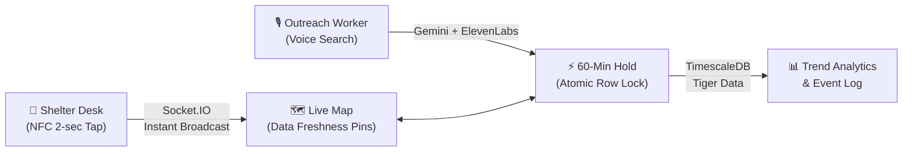
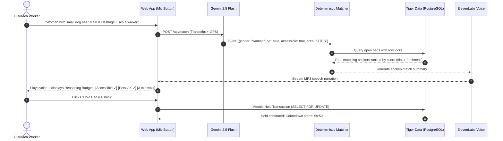

# OpenBed (LumiNestBC) — Pitch Deck

> **"A bed tonight, found in 60 seconds, not 60 phone calls."**  
> *StormHacks 2026 · Metro Vancouver Live Shelter-Bed Network*

---



---

## Slide 1: The Hook & The Reality

### 11:00 PM on East Hastings, Rain Falling
An outreach worker is standing on the sidewalk with a woman in a wheelchair who has a small dog. She needs a warm, safe bed tonight.

- **The Current System:** The worker pulls out the official **BC211 shelter list**. It was last updated at 7:30 PM on a Friday. BC211 updates only twice a day on weekdays. Over weekends and nights, **it is completely frozen**.
- **The Reality:** Outreach workers spend **45 to 60 minutes making blind phone calls** to shelter after shelter while someone shivers beside them. Most shelters are full. Exhausted shelter desk staff field dozens of identical calls all night.
- **The Tragedy:** Every night in Metro Vancouver, people sleep on sidewalks while beds 6 blocks away sit empty because nobody knew they freed up at 10:30 PM.

> [!IMPORTANT]
> **The Problem Isn't Just Beds. It's Information Velocity.**

---

## Slide 2: Why Past Solutions Failed

Cities like Los Angeles spent millions on shelter-bed portals. In 2023, the LA City Controller released a scathing audit: **the system was woefully inaccurate and barely used**.

### Why did they fail?
1. **High Friction for Shelter Staff:** Expecting overworked shelter staff to log into complex enterprise software, remember passwords, and fill out forms every time someone leaves is unrealistic.
2. **Untrusted Data:** A bed count that says "3 open" without a timestamp is dangerous. If a worker walks someone 20 minutes in the rain and finds the bed was taken 4 hours ago, trust in the app is permanently broken.
3. **No Reservation Mechanism:** Finding a bed doesn't help if someone else takes it while you're in transit.

---

## Slide 3: The Solution — OpenBed (LumiNestBC)

OpenBed bridges the gap with three tightly interconnected systems:

```
┌────────────────────────┐      ┌────────────────────────┐      ┌────────────────────────┐
│   1. Tap to Update     │      │   2. Voice Match & Hold│      │   3. Trust the Data    │
│                        │      │                        │      │                        │
│ Physical NFC tags at   │ ───> │ Speak needs naturally; │ ───> │ Real-time freshness    │
│ the front desk.        │      │ AI extracts criteria,  │      │ clock on every pin.    │
│ No login, no app.      │      │ deterministic matcher  │      │ Sub-second updates     │
│ 2 seconds to update.   │      │ ranks real beds & holds│      │ via Socket.IO & TSDB.  │
└────────────────────────┘      └────────────────────────┘      └────────────────────────┘
```

1. **Tap to Update:** Three cheap NFC tags at the front desk: `[Bed Freed (+1)]`, `[Bed Filled (-1)]`, and `[Full (0)]`. Staff tap their phone. Done in 2 seconds. A 10-second instant undo protects against mistaps.
2. **Find & Hold by Voice:** An outreach worker presses a mic button on the map (or calls the 24/7 hotline) and says what they need in plain English. The top spoken match is read back via ElevenLabs, and the bed is locked in with a **60-minute hold**.
3. **Trust Through Freshness:** Every single bed count glows with an honest data-freshness age (`Updated 4 min ago`), backed by TimescaleDB event sourcing.

---

## Slide 4: Flow A — Tap to Update (Zero-Friction Staff Experience)

### Designed for 2:00 AM at a Busy Front Desk
- **No App Installation:** Staff do not need to download anything from an App Store or create an account.
- **Physical NFC Tags:**
  - 🟢 **Bed Freed (+1):** Someone checks out early. Tap phone. Count increases by 1.
  - 🔴 **Bed Filled (-1):** Someone checks in. Tap phone. Count decreases by 1.
  - ⚫ **Full:** Shelter reaches capacity. Tap phone. Count sets to 0.
  - 🔵 **Arrival:** Guest arrives for an active hold. Tap door tag. Hold confirmed.
- **Fail-Safe Idempotency:** If cell service is spotty and the phone retries, unique cryptographic `tap_id` tokens ensure a single tap never double-counts. 5-second tap debounce prevents accidental double-taps.
- **10-Second Undo:** A prominent undo bar allows staff to reverse a mistaken tap with a single touch.

---

## Slide 5: Flow B — The Live Map & Data Freshness

### Visualizing Real Availability Across Metro Vancouver
- **Dynamic Dark Map:** Built on high-performance vector tiles. Shelters with open beds glow softly in emerald green.
- **Honest Data Freshness Pins:**
  - 🟢 **Green Halo (< 60 min):** Staff confirmed recently. High confidence.
  - 🟡 **Amber Halo (60–180 min):** Getting stale; call to verify.
  - 🔴 **Red Halo (> 180 min):** Unconfirmed count.
- **Granular Needs Filtering:** 1-tap toggles for Women Only, Youth (<24), Families, Pets Allowed, Wheelchair/Accessible, and Couples.
- **Sub-Second Real-Time Sync:** When a staff member taps an NFC tag in Surrey, the pin count changes across every outreach worker's phone in Vancouver in **under 300 milliseconds** via WebSockets.

---

## Slide 6: Flow C — Voice Match & 60-Minute Holds



### The 60-Minute Guaranteed Hold
- Outreach workers cannot afford to travel 20 minutes only to find the bed gone.
- Clicking **"Hold Bed"** creates an atomic lock. The public bed count drops by 1 immediately.
- A live visual countdown timer appears on the worker's phone.
- **Race-Condition Proof:** If two workers tap "Hold" on the last remaining bed in the exact same millisecond, PostgreSQL transaction isolation (`SELECT FOR UPDATE`) ensures exactly one wins, while the other is instantly guided to the #2 next-best match.
- **Automatic Return:** If the worker does not arrive within 60 minutes, the server-side cron automatically releases the bed back into the public pool.

---

## Slide 7: Technical Architecture & Stack

```
   ┌──────────────────────────────────────────────────────────┐
   │                  FRONTEND (PWA & Web)                    │
   │  React 19 · TypeScript · Tailwind CSS · Vite             │
   │  MapLibre GL / Leaflet · Motion · Web Speech API         │
   └────────────────────────────┬─────────────────────────────┘
                                │ HTTPS / WSS
   ┌────────────────────────────▼─────────────────────────────┐
   │                     BACKEND ENGINE                       │
   │  Python 3.12 · Flask · Flask-SocketIO · Gunicorn         │
   │                                                          │
   │  ┌───────────────────────┐    ┌───────────────────────┐  │
   │  │   Gemini 2.5 Flash    │    │  ElevenLabs Multiling │  │
   │  │  (Language Extraction)│    │   (Voice Synthesis)   │  │
   │  └───────────────────────┘    └───────────────────────┘  │
   │  ┌────────────────────────────────────────────────────┐  │
   │  │   Deterministic Matcher (Distance + Freshness)     │  │
   │  └────────────────────────────────────────────────────┘  │
   └────────────────────────────┬─────────────────────────────┘
                                │ Connection Pool
   ┌────────────────────────────▼─────────────────────────────┐
   │              DATA PERSISTENCE & TIME-SERIES              │
   │  Tiger Data (TimescaleDB Cloud / PostgreSQL)             │
   │  - Hypertable: availability_events (Time-series audit)   │
   │  - Atomic Row Locks: holds & bed capacity                │
   └──────────────────────────────────────────────────────────┘
```

---

## Slide 8: The Three Core Engineering Principles

### 1. "AI Understands Language; Plain Code Makes Every Decision"
- We **never** let an LLM hallucinate shelter availability or choose who gets a bed.
- **Gemini's only job:** Parse messy natural language (*"I'm with a guy who has crutches around Commercial-Broadway"*) into clean JSON criteria.
- **Deterministic Python:** Applies rigid hard filters (e.g. men are never matched to women-only shelters) and computes optimal scores:
  $$\text{Score} = \text{Distance (km)} + \min\left(\frac{\text{Staleness (min)}}{30}, 10\right)$$

### 2. Privacy by Architecture, Not Policy
- **Zero Client Data:** We do not ask for or store client names, dates of birth, or case histories.
- **DV Shelter Fortress:** Domestic violence shelters are scrubbed at the database repository layer (`public_shelter()`). Their latitude, longitude, address, and phone numbers are stripped before any byte leaves the server. The UI only ever shows: *"Confidential safe-housing available: Call [Hotline]"*.

### 3. Event-Sourced Hypertable (Tiger Data)
- Every single bed increment, decrement, hold, and expiry is written to an immutable TimescaleDB hypertable.
- Provides an auditable historical record of shelter bed fluctuations across seasons, cold-weather alerts, and neighborhoods.

---

## Slide 9: Real Metro Vancouver Data (Today)

We did not build this with mock data. We scraped and structured **67 real Metro Vancouver shelters**:

| Metric | Real Production Numbers |
|---|---|
| **Mapped Shelters** | **67 facilities** across Vancouver, Surrey, Burnaby, Richmond, New West |
| **Total Tracked Capacity** | **1,850+ shelter beds** |
| **Geocoded Pins** | 100% geocoded with coordinates and verified street addresses |
| **Voice Processing Latency** | **< 600 ms** extraction + match ranking |
| **TTS Narration Latency** | High-fidelity ElevenLabs audio generated and cached in memory |
| **Database Response Time** | **< 15 ms** queries on Tiger Data TimescaleDB |

---

## Slide 10: Competitive Matrix

| Capability | BC211 Public List | Legacy City Portals | **OpenBed (LumiNestBC)** |
|---|:---:|:---:|:---:|
| **Update Frequency** | 2x / weekday (stale nights & weekends) | Daily / irregular | **Real-time (instant NFC tap)** |
| **Staff Update Effort** | Phone/email staff | 5-min multi-field form | **2-second phone tap (No login)** |
| **Data Freshness Indicators** | ❌ None | ❌ None | **✅ Color-coded live ages** |
| **Bed Reservation** | ❌ None | ❌ None | **✅ 60-Minute Atomic Hold** |
| **Voice Search (In-App & Phone)** | ❌ None | ❌ None | **✅ Gemini + ElevenLabs** |
| **Race-Condition Protection** | ❌ None | ❌ None | **✅ DB Row-Level Locking** |
| **DV Location Protection** | Manual | Variable | **✅ Scrubbed in Core Engine** |

---

## Slide 11: Roadmap & Future Expansion

- **Phase 1 (Complete):** NFC Tap Board, Live Freshness Map, Web Voice Match, ElevenLabs Spoken Narration, 60-min Holds, 67 Real Shelters in TimescaleDB.
- **Phase 2 (Next 60 Days):**
  - **Extreme Weather Alert Overlays:** Automatic integration with Environment Canada alerts to open emergency weather shelter (EWR) pins when temperatures drop below 0°C.
  - **Transit Routing:** 1-tap walking and TransLink bus/SkyTrain directions directly from the hold confirmation screen.
  - **Automated SMS Nudges:** Twilio worker texts shelters whose count has not updated in over 3 hours: *"Reply with your open beds to refresh your pin"*.
- **Phase 3 (Provincial Scaling):** Partnership with BC Housing and the Homelessness Services Association of BC (HSABC) to distribute NFC tags to all 120+ shelters across British Columbia.

---

## Slide 12: The Closing Ask

> ### "A bed tonight, found in 60 seconds, not 60 phone calls."

By removing all data entry friction for shelter staff and giving outreach workers instant voice search and guaranteed 60-minute holds, OpenBed ensures that no one is left outside in the rain while a bed sits empty.

### OpenBed / LumiNestBC
- **Live Repository:** [github.com/saman-37/LumiNestBC](https://github.com/saman-37/LumiNestBC)
- **Built for:** StormHacks 2026
